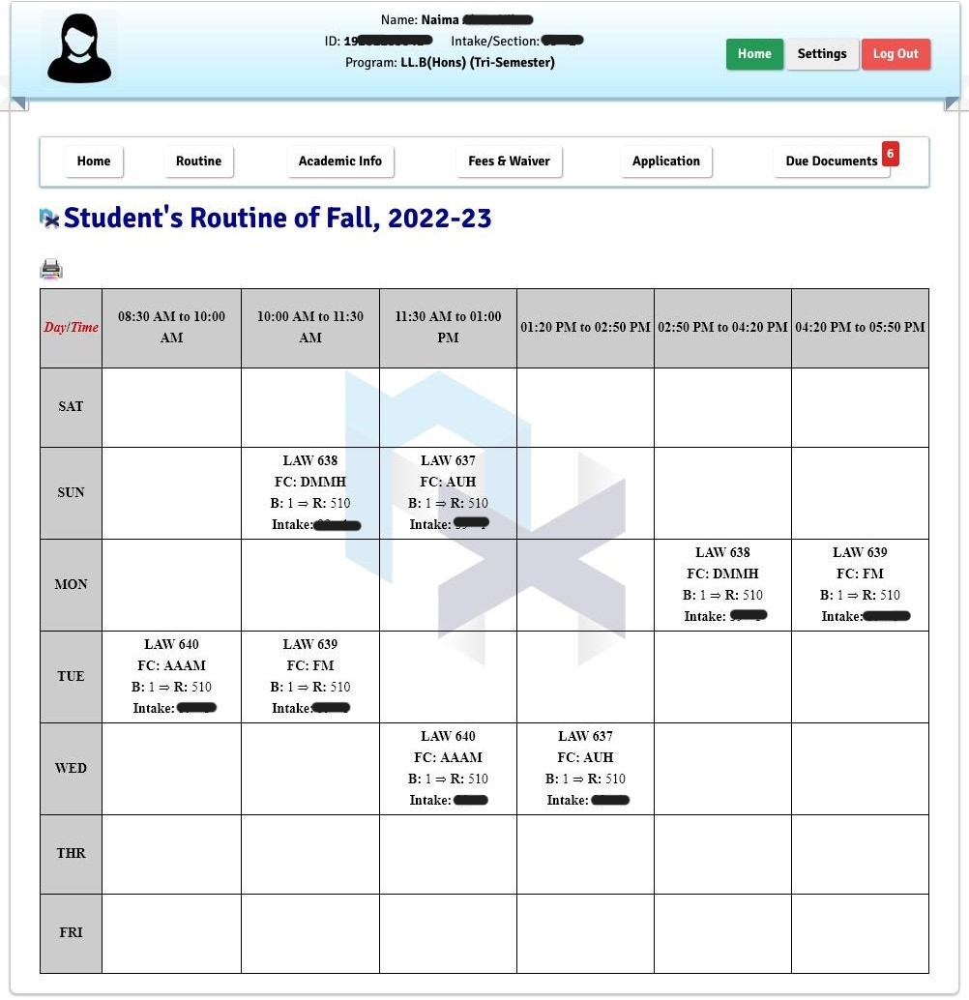

# Annex Server

This script will help you to login on your annex portal then get users and routine data. Also get routine screenshot using pyppeteer library.
<p align="center">
    
</p>


## Special Thanks to
* <a href="https://github.com/xaadu">Abdullah Zayed</a>, for the starter scripts
* Naima Akter Nila, for her annex credentials.


## Now this app is hosted on Mogenius Studio
* INSTANCE: 1
* CPU: 0.5 Core
* RAM: 1 GB
* TEMP STORAGE: 512 MB

## Used Firebase for Storage
After scrapping students images and taking routine screenshot from annex portal then we upload them in firebase storage.


## Library used

requirements.txt
```
APScheduler==3.9.1
beautifulsoup4==4.11.1
CacheControl==0.12.11
cachetools==5.0.0
certifi==2021.10.8
charset-normalizer==2.0.12
click==8.1.3
colorama==0.4.4
firebase-admin==5.2.0
Flask==2.1.2
google-api-core==2.7.2
google-api-python-client==2.46.0
google-auth==2.6.6
google-auth-httplib2==0.1.0
google-cloud-core==2.3.0
google-cloud-firestore==2.4.0
google-cloud-storage==2.3.0
google-crc32c==1.3.0
google-resumable-media==2.3.2
googleapis-common-protos==1.56.0
grpcio==1.44.0
grpcio-status==1.44.0
httplib2==0.20.4
idna==3.3
itsdangerous==2.1.2
Jinja2==3.1.2
MarkupSafe==2.1.1
msgpack==1.0.3
Pillow==9.1.0
proto-plus==1.20.3
protobuf==3.20.1
pyasn1==0.4.8
pyasn1-modules==0.2.8
pyparsing==3.0.8
python-dotenv==0.20.0
pytz==2022.1
pytz-deprecation-shim==0.1.0.post0
requests==2.27.1
rsa==4.8
six==1.16.0
soupsieve==2.3.2.post1
tzdata==2022.1
tzlocal==4.2
uritemplate==4.1.1
urllib3==1.26.9
Werkzeug==2.1.2
selenium~=4.3.0
pyppeteer~=1.0.2
```

## Installation
* clone repository
```commandline
https://github.com/imamhossain94/annex-server.git
cd annex-server
py -m venv venv
venv\Scripts\activate
pip install -r requirements.txt
```

* create .env in projects root
```dotenv
# BUBT links
BASE_URL="https://annex.bubt.edu.bd/"

# Path or Endpoint
LOGIN_PATH = "global_file/action/login_action.php"
DASHBOARD_PATH ="'ONSIS_SEITO/"
ROUTINE_PATH = "?page=routine"
ROUTINE_PRINTER_PATH = "includes/helpers/routine_format.php"

# Firebase Credentials
TYPE="service_account"
PROJECT_ID=""
PRIVATE_KEY_ID=""
PRIVATE_KEY=""
CLIENT_EMAIL=""
CLIENT_ID=""
AUTH_URI="https://accounts.google.com/o/oauth2/auth"
TOKEN_URI="https://oauth2.googleapis.com/token"
AUTH_PROVIDER_X509_CERT_URL="https://www.googleapis.com/oauth2/v1/certs"
CLIENT_X509_CERT_URL=""
```

* Run the projects
```commandline
python wsgi.py
```

## API Example

* Login: [GET] https://annex-server-prod-annex-l4sa4h.mo6.mogenius.io/annex/v1/login?id=<your_annex_id>&pass=<your_annex_pass>

```json
{
  "PHPSESSID":"71bcd3ad03cb3812bf8b48cd8d5*****",
  "status":"true"
}
```

* Profile: [GET] https://annex-server-prod-annex-l4sa4h.mo6.mogenius.io/annex/v1/profile?phpsessid=<session_id_obtained_by_login_API>

```json
{
  "id": "192011050**",
  "image_url": "https://annex.bubt.edu.bd/ONSIS_SEITO/images/nximage/female.png",
  "intake": "39",
  "name": "Naima ***** ****",
  "program": "LL.B",
  "section": "1",
  "semester_type": "Hons",
  "status": "true"
}
```

* Routine as Data: [GET] https://annex-server-prod-annex-l4sa4h.mo6.mogenius.io/annex/v1/routine?type=data&phpsessid=<session_id_obtained_by_login_API>

```json
{
  "data": [
    {
      "building": "1",
      "courseCode": "638",
      "day": "SUN",
      "facultyCode": "DMMH",
      "facultyLink": "?page=e2fd0e7d2857bdcd6a306a5d658c017f&semNo=059&crsId=LAW%20638&inTk=&seEc=1&fCode=DMMH",
      "intake": "39",
      "programCode": "LAW",
      "room": "510",
      "schedule": {
        "end": "10:00 AM",
        "start": "10:00 AM",
        "timeObj": "10:00 AM to 11:30 AM"
      },
      "section": "1"
    },
    {
      "building": "1",
      "courseCode": "637",
      "day": "SUN",
      "facultyCode": "AUH",
      "facultyLink": "?page=e2fd0e7d2857bdcd6a306a5d658c017f&semNo=059&crsId=LAW%20637&inTk=&seEc=1&fCode=AUH",
      "intake": "39",
      "programCode": "LAW",
      "room": "510",
      "schedule": {
        "end": "11:30 AM",
        "start": "11:30 AM",
        "timeObj": "11:30 AM to 01:00 PM"
      },
      "section": "1"
    }
  ],
  "status": "success",
  "type": "data"
}
```

* Routine as Image: [GET] https://annex-server-prod-annex-l4sa4h.mo6.mogenius.io/annex/v1/routine?type=image&phpsessid=<session_id_obtained_by_login_API>

```json
{
  "status": "true",
  "type": "image",
  "url": "https://storage.googleapis.com/bubt-smart-routine.appspot.com/images/routine/Naima%20****%20****_***********.png"
}
```


## 🧑 Author

#### Md. Imam Hossain

You can also follow my GitHub Profile to stay updated about my latest projects:

[](https://github.com/imamhossain94)

If you liked the repo then kindly support it by giving it a star ⭐!

Copyright (c) 2021 MD. IMAM HOSSAIN
